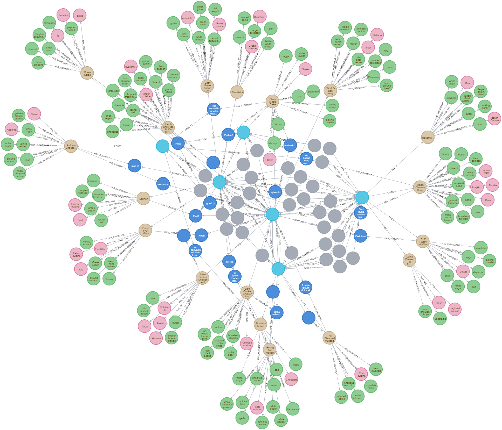

# eat-me

### About
One of the goals of the work is to develop an interactive web application that works
using the GraphQL query language. The personal assumption was to create software,
which would be the answer to a rushing society where no doubt
Tinder was the inspiration - but the idea was not people-to-people contacts,
but rather gastronomy, where you can quickly and easily choose your favorite dishes and share yours.

<div>


</div>

### Dependencies
  * Node v10.16.0 (with JS)
  * Npm 6.9.0
  * Neo4j 4.0.3
  * React (with TS 3.7)
  * Apollo
  * GraphQL
  
### Build and run
#### Neo4j
1. Open Neo4j Desktop
1. Add new project
1. Start Project
   1. Install APOC plugin via ``Add Plugin``
   1. Click play button
   1. Set password
   1. Click *Open with Neo4j Browser*
   1. Initial username is `neo4j`
1. Data import (optional)
   1. Open `Settings` view through three dots and `Manage` button in Neo4j Desktop
   1. Add at the end of the file ``apoc.import.file.enabled=true``
   1. Move `all.graphml` file from backend folder to `dbms.directories.import` ([More information](https://neo4j.com/docs/labs/apoc/current/export/json/)), 
   i.e ``%NEO4J_FOLDER\neo4jDatabases\database-x\installation-x\import``
   1. Write ``CALL apoc.import.graphml("file://all.graphml", {})`` in Neo4j Browser "Terminal"
 
 You have successfuly imported data :)
 Write ``MATCH (n) RETURN n`` for schema details
 
 

 
 #### Terminal things
 ##### Backend  
```
  cd backend
  npm install
  touch .env
```
Required .env data:
```
NEO4J_PASSWORD=*your neo4j password*
JWT_SECRET=*your jwt secret*
```
Start server
```
node app
```
 
 ##### Frontend
 ```
  cd frontend
  npm install
  npm run start
 ```


 ##### Electron 
```
cd electron
npm install
npm run dist

wait...

build/win-unpacked/eat-me.exe

```

### License
This project is licensed under the MIT License - see the [License File](LICENSE) for details
